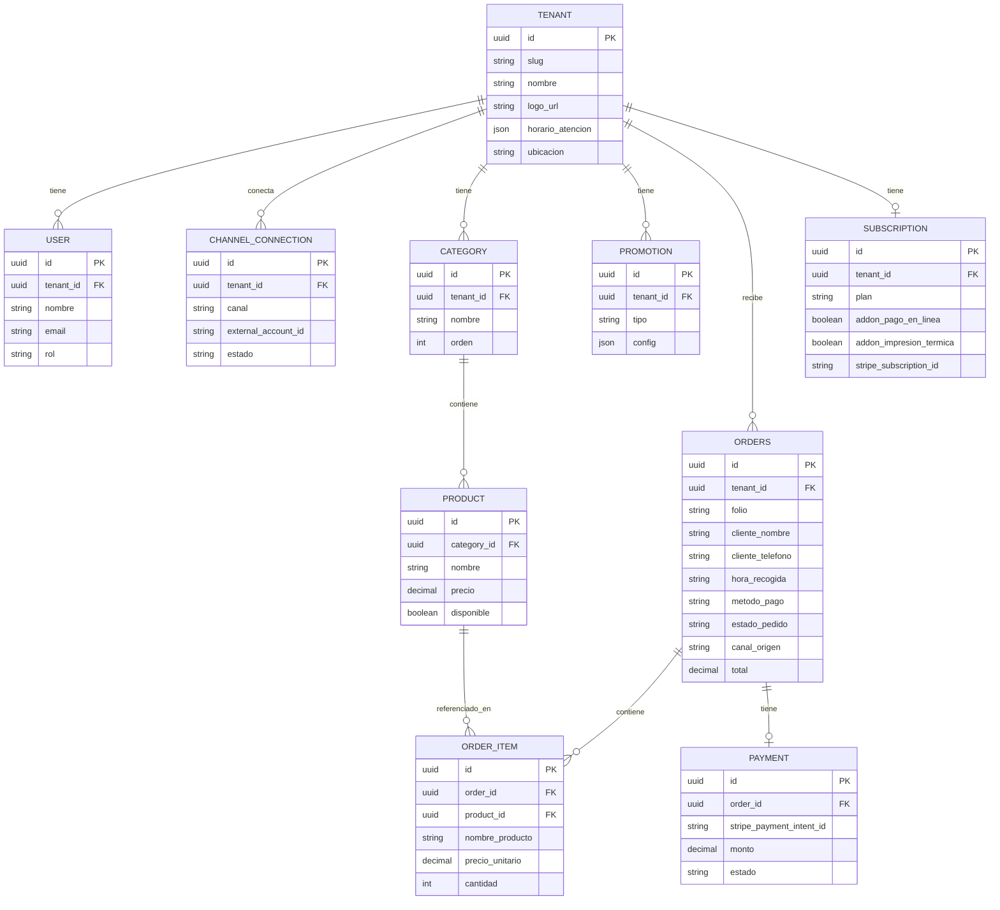

# Aelika — Documento de Planeación

*Última actualización: en construcción — documento vivo, se irá completando por secciones.*

---

## 1. Visión General y Alcance del Producto

### 1.1 Nombre de trabajo
**Aelika**

### 1.2 Problema que resolvemos
Negocios con servicio de pedidos o pickup (pizzerías, cafeterías, negocios de comida, etc.) quieren que sus clientes puedan ordenar sin llamar por teléfono y sin necesidad de que alguien esté físicamente atendiendo el pedido, pero:
- Construir un chatbot a la medida (como el de Entredos Café) requiere desarrollo custom por cada negocio
- Plataformas tipo Uber Eats Pickup resuelven esto pero cobran comisión por pedido
- No existe una forma sencilla para que el negocio administre su propio catálogo, promociones, pedidos y pagos sin depender de un desarrollador

### 1.3 Visión del producto
Una plataforma SaaS multi-tenant tipo "Uber Eats Pickup, pero sin comisiones", donde cualquier negocio puede:
1. Crear su cuenta y dar de alta su negocio
2. Configurar su propio chatbot de pedidos (mismo alcance funcional que el ejemplo de Entredos Café) sin escribir código
3. Vincular el chatbot a **WhatsApp, Instagram y Facebook desde el día 1**
4. Administrar su catálogo (categorías, productos, promociones) en una interfaz tipo Uber Eats
5. Configurar su método de cobro: **pago en línea, pago al recoger, o ambos** (configurable por negocio)
6. Ver y gestionar sus pedidos, con histórico
7. Consultar un dashboard con métricas del negocio
8. Contar con un **catálogo web público** (menú tipo Uber Eats) accesible por link propio, tanto desde dentro del chat como de forma independiente (QR, redes sociales)

### 1.4 Usuarios objetivo
- **Negocios**: pizzerías, cafeterías, negocios de comida y similares que ofrecen pedidos/pickup y quieren que sus clientes ordenen sin hablar por teléfono ni depender de que alguien esté ahí físicamente tomando el pedido
- **Cliente final**: interactúa vía el chatbot (WhatsApp, Instagram o Facebook) y/o el catálogo web público del negocio (link directo o QR); no tiene acceso al panel administrativo
- **Negocio (panel administrativo)**, con 3 roles:

| Rol | Permisos |
|---|---|
| **Operador** | Ver y recibir pedidos (gestionar su estatus operativo: recibido, en preparación, listo, entregado) |
| **Gerente** | Todo lo del Operador + editar catálogo (productos, categorías, promociones) |
| **Dueño** | Todo lo del Gerente + ver dashboard/métricas de desempeño operativo y económico |

### 1.5 Alcance (MVP)
- Registro y onboarding de negocios (multi-tenant)
- Un negocio = una sucursal/ubicación por cuenta (multi-sucursal es fase futura)
- Configurador de chatbot (flujos tipo el de Entredos: bienvenida → menú → categorías → productos → carrito → datos de pickup → confirmación)
- Vinculación de chatbot a **WhatsApp, Instagram y Facebook Messenger**
- CRUD de catálogo: categorías, productos, precios, fotos, promociones
- Configuración de método de pago por negocio: en línea, al recoger, o ambos
- Módulo de pedidos: listado, estatus, histórico
- Dashboard de métricas básicas (pedidos por periodo, productos más vendidos, ingresos) — visibilidad según rol

### 1.6 Fuera de alcance
- No es un CRM (no gestión de relación con clientes más allá de lo necesario para el pedido)
- No es un chatbot genérico de preguntas y respuestas — es específicamente un chatbot transaccional/de pedidos
- Delivery con logística propia (repartidores) — es pickup, no delivery
- App móvil nativa (el chatbot vive dentro de WhatsApp/Instagram/Facebook, no requiere app propia)
- Multi-idioma — *fase futura*
- Multi-sucursal por cuenta — *fase futura*

### 1.7 Modelo de negocio
**Plan Base** (suscripción mensual, por negocio) incluye:
- Chatbot configurable + vinculación WhatsApp/Instagram/Facebook
- Catálogo (CRUD completo)
- Módulo de pedidos + histórico
- Dashboard de métricas (según rol)
- Pago al recoger

**Add-ons de pago** (opcionales, se suman al plan base):
- Pago en línea — habilita cobro dentro del flujo del chatbot
- Impresión de comanda en impresora térmica — envía el pedido automáticamente a impresora del negocio

**Sin comisión por pedido** (al menos en esta primera etapa) — diferenciador frente a plataformas tipo Uber Eats Pickup.

*Pendiente: definir si los add-ons tienen costo fijo mensual adicional u otro esquema — detalle de pricing a resolver más adelante.*

---

## 2. Arquitectura Técnica

### 2.1 Decisión clave: motor del chatbot
El bot de referencia (Entredos Café) está construido con **Botpress**. Para Aelika, la decisión es **orquestar sobre Botpress** en lugar de construir un motor conversacional propio desde cero (prioriza velocidad de desarrollo; se revalúa a futuro si Botpress no soporta la escala necesaria).

Hallazgos relevantes sobre Botpress que sustentan el diseño:
- Soporta despliegue nativo en WhatsApp, Instagram, Facebook Messenger y Webchat.
- Tiene una Admin API robusta: prácticamente todo lo disponible en el Dashboard de Botpress también es controlable vía API — esto permite que el panel de Aelika administre Botpress "por detrás" sin que el negocio lo toque directamente.
- Es un patrón ya usado por otros SaaS verticales: generar/gestionar bots de forma programática y poblarlos con datos del cliente al momento del registro.
- Modelo de costos variable a vigilar: cobra por plan base + uso de tokens de IA + mensajes/canales de terceros. WhatsApp vía Meta cuesta aprox. $0.008–$0.063 USD por mensaje.

### 2.2 Patrón de arquitectura: bot único multi-tenant
Para evitar que el costo y la complejidad se disparen al crecer, **no se crea un bot de Botpress por negocio**. En su lugar:

1. Cada negocio conecta **su propia cuenta** de WhatsApp Business / Instagram / Facebook al onboarding (flujo OAuth / Embedded Signup de Meta, requiere verificación de negocio ante Meta).
2. Existe **un único bot en Botpress**, compartido por todos los negocios (el "motor conversacional").
3. Cuando llega un mensaje, Botpress identifica la cuenta receptora (ID de número de WhatsApp / cuenta de Instagram / página de Facebook).
4. Ese ID se resuelve contra la **API de Aelika**, que identifica el `tenant_id` (negocio) correspondiente.
5. Toda la conversación (catálogo, promociones, horarios, método de pago habilitado, mensajes, marca) se alimenta en tiempo real desde la **base de datos de Aelika** vía API/webhooks — Botpress solo orquesta el flujo conversacional genérico; el contenido y las reglas de negocio viven en Aelika.

**Flujo resumido:**
```
Negocio A (WhatsApp) ─┐
Negocio B (Instagram) ─┼─▶ Bot único (Botpress) ─▶ API Aelika (resuelve tenant) ─▶ Base de datos Aelika
Negocio C (Facebook)  ─┘         "motor conversacional compartido"     (catálogo, pedidos, pagos, config)
```

### 2.3 Costo variable — insumo para pricing
Existen costos marginales por conversación (plan Botpress + mensajería de Meta) que deben cubrirse dentro de la suscripción mensual, dado el modelo "sin comisión por pedido". Se retoma cuando se definan los planes/precios exactos.

### 2.4 Componentes propios de Aelika (desarrollo propio, fuera de Botpress)
- **Backend/API multi-tenant**: catálogo, pedidos, usuarios/roles, configuración de bot por negocio, resolución de tenant
- **Panel administrativo (frontend)**: onboarding, configurador de bot, CRUD de catálogo, pedidos, dashboard
- **Servicio de pagos**: integración con Stripe + lógica de "pago en línea vs pago al recoger" configurable por negocio
- **Servicio de impresión térmica**: acción manual, disparada desde el panel (no automática). Soporta dos escenarios de conexión — ver detalle completo y recomendación en sección "Impresión térmica — mecanismo técnico" más abajo
- **Dashboard/analítica**: agregaciones sobre pedidos para las métricas por rol

### 2.5 Estrategia de multi-tenancy (modelo de datos)
Base de datos **compartida** con `tenant_id` en cada tabla relevante (no DB/schema separado por negocio en el MVP):
- Más simple de operar, migrar y escalar al inicio
- Aislamiento reforzado con middleware que inyecta `tenant_id` en cada query + Postgres Row-Level Security como capa extra
- Migrable a schema-per-tenant en el futuro si algún cliente grande lo exige

### 2.6 Stack tecnológico propuesto

| Capa | Elección | Por qué |
|---|---|---|
| Backend | Node.js + TypeScript, **NestJS** | Estructura modular y RBAC/guards nativos — encaja con multi-tenant + 3 roles |
| Base de datos | **PostgreSQL** + **Prisma** | Relacional, soporta Row-Level Security; Prisma da tipado end-to-end |
| Frontend (panel admin) | **Next.js (React)** | Mismo lenguaje que el backend, buen soporte para dashboards y SSR |
| Colas / background jobs | **BullMQ + Redis** | Procesar webhooks (Botpress/Meta/Stripe) sin bloquear la API; despacho confiable de impresión térmica |
| Almacenamiento de archivos | S3-compatible (AWS S3 o Cloudflare R2) | Fotos de producto, logos de negocio |
| Pagos | **Stripe** | Definido por el negocio; Stripe Connect queda en el radar si se necesita split de pagos a futuro |

### 2.7 Hosting — recomendación
Empezar con **plataforma administrada** en vez de AWS/GCP puro, dado que la etapa actual es de validación de producto, no de hiperescala:
- Backend + Postgres + Redis → Render o Railway
- Frontend Next.js → Vercel
- Migrar a AWS/GCP más adelante es viable sin bloqueos (Node.js + Postgres son portables)

### 2.8 Catálogo web público (storefront)
Cada negocio tiene un mini sitio de catálogo/checkout accesible en:

```
pide.aelika.com/{slug-negocio}
```

- **Path-based en un solo subdominio** (no subdominio por negocio) — más simple de operar en el MVP: sin DNS wildcard ni gestión de certificados SSL por negocio, una sola app con ruteo dinámico
- **Identificador = slug legible**, elegido por el negocio en el onboarding (con validación de unicidad), no un token opaco — más fácil de compartir (QR de mesa, bio de Instagram, de viva voz)
- Un token opaco sí se usa para cosas sensibles como el tracking de un pedido específico (ej. `pide.aelika.com/{slug}/pedido/{token}`)

**Dos puntos de entrada, misma app:**
1. **Webview desde el chat**: el bot lo abre cuando el cliente toca el botón de "Ver Menú y Ordenar"
2. **Link independiente**: compartible en QR, redes sociales, etc. — funciona sin que exista una conversación de chat activa

Esto implica que el **checkout completo (carrito, datos del cliente, método de pago, confirmación) vive en esta web app**, no en el flujo conversacional del bot — el bot solo saluda, resuelve horario/ubicación y enlaza hacia acá. La orden se crea vía la API de Aelika sin depender de una sesión de WhatsApp/Instagram/Facebook activa.

### 2.9 Impresión térmica — mecanismo técnico
Se deben soportar dos escenarios de conexión en los negocios: **impresora USB conectada a una computadora** y **tablet conectada a impresora por WiFi/Bluetooth**.

**Escenario A — USB + computadora:**
| Opción | Cómo funciona | Recomendación |
|---|---|---|
| Driver del sistema + impresión del navegador | Impresora instalada como impresora normal del SO; el panel genera un ticket HTML/CSS del ancho correcto (58mm/80mm) y dispara `window.print()` | **Punto de partida** — cero integración con hardware |
| WebUSB (Chrome/Edge) | El navegador manda comandos ESC/POS crudos directo por USB | Mejora futura si se necesita mejor fidelidad (corte automático) |
| Puente local (ej. QZ Tray) | App local que recibe trabajos de impresión del panel vía JS y los manda a la impresora | Solo si negocios reales lo requieren — evita construir infraestructura antes de tiempo |

**Escenario B — Tablet + WiFi/Bluetooth:**
- **Bluetooth directo desde el navegador no es viable de forma confiable**: Safari (iPad) no soporta Web Bluetooth ni Web Serial; Android Chrome tiene soporte parcial y frágil; la mayoría de impresoras económicas usan Bluetooth Clásico (SPP), que la Web Bluetooth API no soporta (solo habla BLE)
- **Solución recomendada — impresoras con soporte de impresión en la nube (ej. Star CloudPRNT)**: la impresora se conecta directo al WiFi/LAN del negocio y consulta periódicamente al servidor de Aelika si hay un trabajo pendiente. Es la impresora la que "jala" el trabajo — no existe conexión directa entre la tablet y la impresora, por lo que Bluetooth deja de ser un problema. No requiere puente ni software adicional instalado en ningún dispositivo

**Recomendación general:**
1. Estándar recomendado para negocios nuevos: impresora multi-interfaz (USB + Ethernet/WiFi) con soporte de impresión en la nube tipo CloudPRNT — cubre ambos escenarios sin puente
2. Ruta de compatibilidad para negocios que ya tienen impresora: impresión estándar del navegador (Escenario A, opción 1) — no bloquea el piloto mientras se construye la integración con CloudPRNT
3. Evitar Bluetooth directo desde el navegador como estrategia principal

**Decisión de hardware para el piloto:** se compró una **GHIA GTP801** (térmica, 80mm, 203dpi, USB + Ethernet, ESC/POS, corte automático) para arrancar con el Escenario A (USB + computadora, impresión vía navegador). Al tener también Ethernet, queda disponible para probar más adelante la ruta de red (poller propio o CloudPRNT) sin comprar hardware adicional.

---

## 3. Módulos Funcionales

### 3.1 Configurador de Chatbot
*(Nota: esta sección describe el diseño objetivo del producto. En Fase 1 esta configuración la captura Santiago directamente en la base de datos/Botpress; se vuelve autoservicio hasta Fase 2 — ver sección 5.)*

El bot cumple un rol de **bienvenida y FAQ, no de flujo de pedido** — el pedido ocurre en el catálogo web público (ver 2.8 y 3.2). Lo único personalizable por negocio es:

- **Mensaje inicial / bienvenida** (editable)
- **Horario de atención**: el bot lo usa para responder consultas ("¿a qué hora abren?") y para bloquear el acceso a pedidos fuera de horario
- **Ubicación**: dirección / link de mapa; el bot lo usa para responder consultas ("¿dónde están?")
- Botón/link que abre el catálogo web del negocio para navegar y ordenar

### 3.2 Catálogo y Storefront Web (tipo Uber Eats)

**Administración (panel del negocio):**
- **Categorías**: crear/editar/eliminar, ordenar
- **Productos**: producto simple en MVP — nombre, descripción, precio, foto, disponibilidad (activo/inactivo). Sin variantes/modificadores en el MVP (ej. tamaños, extras) — se anota como fase futura, relevante para negocios tipo pizzería
- **Promociones**:
  - Descuento por producto (porcentaje o monto fijo)
  - Combos (ej. 2x1, paquete de productos a precio especial)

**Cara al cliente — catálogo web (`pide.aelika.com/{slug-negocio}`):**
- Navegación por categorías/productos con promociones visibles, estilo Uber Eats
- Carrito de compra
- Checkout: nombre, teléfono, notas del pedido, hora estimada de recogida, método de pago (según lo habilitado por el negocio)
- Confirmación del pedido
- Accesible desde el botón del chat o de forma independiente (QR, redes sociales), sin depender de una conversación activa

### 3.3 Pedidos (Órdenes de Compra)
- El cliente genera la orden desde el catálogo web (checkout) — llega al panel en tiempo real
- **Estatus, estrictamente secuenciales** (se avanza un paso a la vez con una acción "Avanzar", sin saltos ni retroceso en el MVP):
  1. Pendiente de confirmación
  2. Confirmado y surtiendo
  3. Listo para entrega
  4. Despachado
- El Operador puede avanzar el estatus (según los permisos definidos en 1.4)
- Histórico con filtro por fecha/estatus
- Detalle de pedido: productos, cliente (nombre, teléfono, notas, hora de recogida), método de pago, hora
- **Impresión de comanda/ticket**: acción manual desde el detalle de la orden en el panel — genera un ticket con toda la información del pedido listo para imprimir en la impresora térmica del negocio (ver 2.4 sobre el mecanismo técnico, aún por definir)

### 3.4 Dashboard
- Pedidos por periodo (día/semana/mes)
- Productos más vendidos
- Ingresos (según método de pago)
- *(pendiente: definir si se agregan métricas adicionales, ej. hora pico de pedidos, tasa de abandono del chatbot)*

---

## 4. Modelo de Datos

Basado en el enfoque multi-tenant con base de datos compartida (sección 2.5): todas las tablas relevantes incluyen `tenant_id`.



**Decisiones de diseño relevantes:**
- `tenant_id` presente en todas las tablas de negocio — base del aislamiento multi-tenant
- `CHANNEL_CONNECTION.external_account_id` (índice único) — es el campo que Botpress usa para resolver a qué negocio pertenece un mensaje entrante
- `TENANT.slug` (índice único) — identificador de `pide.aelika.com/{slug}`
- `ORDER_ITEM` guarda una copia ("snapshot") de `nombre_producto` y `precio_unitario` al momento del pedido — si el negocio cambia el precio o nombre de un producto después, el histórico de pedidos no cambia retroactivamente
- `PAYMENT` y `SUBSCRIPTION` son conceptos distintos: `PAYMENT` es el cobro al cliente final por su pedido; `SUBSCRIPTION` es lo que el negocio paga a Aelika cada mes. Ambos pasan por Stripe pero son flujos de dinero separados (conecta con el pendiente de evaluar Stripe Connect)

---

## 5. Roadmap / Fases

### Fase 0 — Fundacional
- Setup de infraestructura: backend NestJS, Postgres + Prisma, frontend Next.js, hosting (Render/Vercel)
- Modelo de datos base: `TENANT`, `USER` con roles, autenticación
- Onboarding de negocio: registro, creación de cuenta, slug, nombre, logo, horario, ubicación

### Fase 1 — MVP con piloto manual: Catálogo, Storefront y Pedidos
- CRUD de catálogo en el panel: categorías, productos, promociones
- Catálogo web público (`pide.aelika.com/{slug}`): navegación, carrito, checkout — pago al recoger únicamente (Stripe se pospone)
- Módulo de pedidos: listado, cambio de estatus, histórico, impresión manual de comanda
- **Bot y canales configurados a mano por Santiago** (no autoservicio todavía):
  - Bot único en Botpress — mensaje de bienvenida, horario y ubicación se capturan directo en la base de datos de Aelika (sin formulario en el panel); la arquitectura de bot único multi-tenant (2.2) no cambia, solo cómo se llenan los datos
  - WhatsApp Business, Instagram y Facebook conectados directo en Meta Business Manager/Botpress para cada negocio piloto (sin flujo OAuth propio todavía)
- **Meta de esta fase**: los 3 negocios piloto (Entredós, Banetto, Envases Reynoso) operando end-to-end con el paquete completo del pitch — catálogo + bot en los 3 canales + pickup, sin comisión — sin depender aún de autoservicio

### Fase 2 — Autoservicio: Configurador de bot y vinculación de canales
- Configurador de bot en el panel (mensaje de bienvenida, horario, ubicación) — autoservicio
- Vinculación OAuth de WhatsApp Business, Instagram y Facebook (Embedded Signup de Meta) — autoservicio
- **Meta de esta fase**: un negocio nuevo puede darse de alta y conectar todo sin que Santiago intervenga manualmente

### Fase 3 — Pagos en línea y Dashboard
- Integración con Stripe (add-on de pago en línea)
- Dashboard de métricas: pedidos por periodo, productos más vendidos, ingresos

### Fase 4 — Suscripción/Billing de Aelika + Impresión térmica
- Cobro de la suscripción mensual del negocio a Aelika vía Stripe (plan base + add-ons)
- Impresión térmica en la nube (poller propio o CloudPRNT) si el piloto lo requiere

### Fase 5 — Beta abierta / escalar onboarding
- Apertura a negocios nuevos fuera del piloto inicial, ya 100% self-serve
- Iteración según feedback

---

## Pendientes abiertos del documento
- Definir esquema de precios exacto de add-ons (pago en línea, impresión térmica)
- Evaluar si se requiere Stripe Connect para split de pagos a futuro
- Probar en campo con negocios piloto (Entredós/Banetto/Envases Reynoso) el flujo completo de impresión con la GHIA GTP801 ya comprada, para confirmar que la ruta simple (impresión del navegador) es suficiente antes de invertir en la ruta de red
